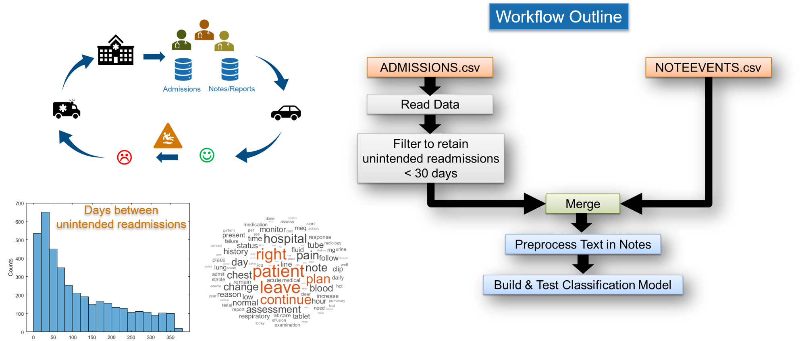

### Predict Hospital Readmissions using Text Analytics in MATLAB
**Goal**: Build a model to predict if there will be an unintended readmission within 30 days by analyzing notes of doctors and nurses using text analytics techniques in MATLAB.

For this analysis, MIMIC-III data has been downloaded from https://physionet.org/content/mimiciii/1.4/ and used to bulid a model to predict hospital readmissions.

This demo has 4 .mlx files.
* Overview_MIMIC_Demo_00.mlx: This provides overview of the demo.
* ReadData_MIMIC_Demo_01.mlx: Import all relevant information, manipulate to clean and filter the data, and finally combine to make a single dataset for building the model.
* Preprocess_MIMIC_Demo_02.mlx: Preprocess the data to get it ready for building a predictive model.
* BuildModel_MIMIC_Demo_03.mlx: Build a model and test to ensure acceptable accuracy.
